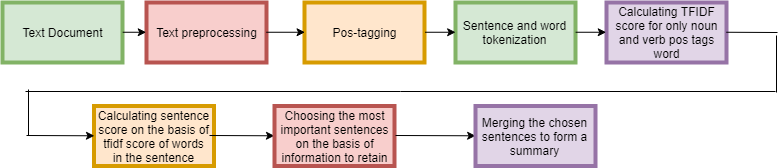

<h1>Notes-Summarizer: <a href="https://notes-summarizer.herokuapp.com/"> Try A Demo Here!</a></h1>

  
  
  

 
 

  <h2>Implementation</h2>
   
  

   
  1. Removing all Stopwords.  
  2. Stemming is performed. 
  3. Part of speech tagging is performed in order to obtain nouns. 
  4. Term frequency and  inverse document frequency matrix are created. 
  5. Sentence score is given, and the average is calculated. 
  6. A threshold score (1.1 * average sentence score) is set, and all sentences above it are extracted. 
  7. Sentences are arranged in the chronological order of their original text. 

 
 

  <h2>About the Algorithm Used - <i>tf-idf</i></h2>
  The Term frequency method scores the words based on their occurrences. Term Frequency incorrectly emphasizes on commonly occurring words which may not contribute to the overall meaning. Hence, inverse document frequency provides a factor that reduces the weight of the pieces that occur frequently and increases the value of times, which happens rarely. Here, it is assumed that rarely occurring words are relatively more important. The IDF is a logarithmically scaled fraction to measure the amount of knowledge provided by the word. The TF-IDF is a product of the term frequency and the Inverse Document Frequency to define the importance of the keyword or the phrase within the original document. <a href="https://en.wikipedia.org/wiki/Tf%E2%80%93idf"> Read More Here </a>

